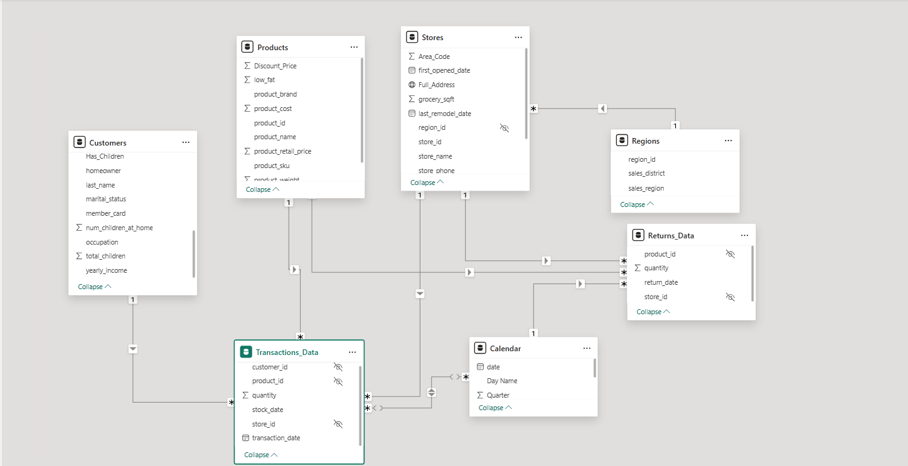

# **Maven Market Power BI Project – README**

## **Project Overview**

This project demonstrates how to build a professional **Power BI retail analytics dashboard** for **Maven Market**.
It covers:

* Data loading and cleaning
* Data modeling and relationship building
* Calculated columns & DAX measures creation
* Dashboard development with interactive visuals, bookmarks, and navigation.

---

## **1. Initial Setup**

### **Power BI Options**

* **Disabled**: `Autodetect new relationships after data is loaded`
* **Locale for import**: `English (United States)`

---

## **2. Data Connections & Transformations**

### **Customers Table**

* Connected to `MavenMarket_Customers.csv`
* Data prep:

  * Promoted headers
  * `customer_id`: Whole number
  * `customer_acct_num` & `customer_postal_code`: Text
* Columns added:

  * **full\_name** = `first_name & " " & last_name`
  * **birth\_year** = `YEAR(birthdate)`
  * **has\_children** = `"N"` if `total_children=0` else `"Y"`

---

### **Products Table**

* Connected to `MavenMarket_Products.csv`
* Data prep:

  * `product_id`: Whole number
  * `product_sku`: Text
  * `product_retail_price` & `product_cost`: Decimal number
* Profiling:

  * **111 brands**
  * **1,560 product names**
* Columns:

  * **discount\_price** = `0.9 * product_retail_price` (rounded to 2 decimals)
* Clean-up: Replace `null` with `0` in `recyclable` & `low-fat`

---

### **Stores Table**

* Connected to `MavenMarket_Stores.csv`
* Data prep:

  * `store_id` & `region_id`: Whole numbers
* Columns:

  * **full\_address** = `store_city, store_state, store_country`
  * **area\_code** = extract area code from `store_phone`

---

### **Regions Table**

* Connected to `MavenMarket_Regions.csv`
* Data prep: `region_id`: Whole number

---

### **Calendar Table**

* Added columns:

  * Start of Week
  * Day Name
  * Start of Month
  * Month Name
  * Quarter
  * Year

---

### **Returns Table**

* Connected to `MavenMarket_Returns.csv`
* Data types corrected (IDs & Quantity)

---

### **Transactions Table**

* Combined folder source:

  * `MavenMarket_Transactions_1997.csv`
  * `MavenMarket_Transactions_1998.csv`
* Removed `Source.Name`
* Data types corrected (IDs & Quantity)
* Validated date range: **1/1/1997 – 12/30/1998**

---

### **Refresh Settings**

* Disabled "Include in Report Refresh" for all lookup tables except transactions
* Saved as **MavenMarket\_Report.pbix**

---

### **Screenshot Reference**

---

## **3. Data Model & Relationships**

* Lookup tables placed on top, data tables below
* Relationships:

  * Transactions → Customers, Products, Stores
  * Transactions → Calendar (`transaction_date`) & inactive `stock_date`
  * Returns → Products, Calendar, Stores
  * Stores → Regions (snowflake schema)
* Cardinality: \**1:* (one-to-many)\*\*, single-direction filters
* Hid all foreign keys & `region_id` in Stores

---

### **Screenshot Reference**

---

## **4. Formatting & Enhancements**

* Dates → `M/d/yyyy`
* Currency formatting → `product_retail_price`, `product_cost`, `discount_price`
* Categorization:

  * Customers: city, postal code, country
  * Stores: city, state, country, full address

---

## **5. Calculated Columns**

* Calendar:

  * `Weekend` = Y/N
  * `End of Month` = last date of each month
* Customers:

  * `Current Age` = `DATEDIFF(birthdate, TODAY(), YEAR)`
  * `Priority` = `"High"` if homeowner + golden membership else `"Standard"`
  * `Short_Country` = first 3 uppercase chars of country
  * `House Number` = text before first space in address
* Products:

  * `Price_Tier` = `"High"`, `"Mid"`, `"Low"`
* Stores:

  * `Years_Since_Remodel` = years since last remodel

---

### **Screenshot References**

---

## **6. Measures (DAX)**

* Quantity & Returns:

  * `[Quantity Sold]`, `[Quantity Returned]`
  * `[Total Transactions]`, `[Total Returns]`
  * `[Return Rate] = Quantity Returned ÷ Quantity Sold`
* Weekend:

  * `[Weekend Transactions]`, `[% Weekend Transactions]`
* Revenue & Profit:

  * `[Total Revenue] = SUMX(Transactions, qty * price)`
  * `[Total Cost] = SUMX(Transactions, qty * cost)`
  * `[Total Profit] = Total Revenue - Total Cost`
  * `[Profit Margin] = Total Profit ÷ Total Revenue`
* Unique products:

  * `[Unique Products] = DISTINCTCOUNT(product_name)`
* YTD & Rolling:

  * `[YTD Revenue] = TOTALYTD()`
  * `[60-Day Revenue] = DATESINPERIOD()`
* Last month KPIs:

  * `[Last Month Transactions]`, `[Last Month Revenue]`, `[Last Month Profit]`, `[Last Month Returns]`
* Revenue Target:

  * `[Revenue Target] = LastMonthRevenue * 1.05`

---

## **7. Dashboard Visualizations**

### **Topline Performance Page**

1. **Matrix**:

   * Product Brand vs. Transactions, Profit, Margin, Return Rate
   * Conditional formatting:

     * Data bars for Transactions
     * White→Green for Profit Margin
     * White→Red for Return Rate
   * Filter: Top 30 brands

2. **KPI Cards**:

   * Current Month Transactions vs. Last Month
   * Current Month Profit vs. Last Month
   * Current Month Returns vs. Last Month (Low = Good)

3. **Map Visual**:

   * Transactions by store city
   * Slicer for country (Select All enabled, vertical stack orientation)

4. **Treemap**:

   * Transactions by Country → State → City (drillable)

5. **Column Chart**:

   * Weekly Revenue Trending (filtered to 1998)

6. **Gauge Chart**:

   * Total Revenue vs. Revenue Target
   * Filter: Top 1 latest Start of Month

7. **Interactions**:

   * Disabled Matrix → Treemap interaction

8. **Bookmarks & Navigation**:

   * USA → Portland saved as bookmark **“Portland 1000 Sales”**
   * Notes page added with commentary and navigation button
   * Additional insights bookmarked and linked

---

### **Screenshot References**

---

## **8. Final Deliverables**

* **Power BI File**: `MavenMarket_Report.pbix`
* **Pages**:

  * Topline Performance (main dashboard)
  * Notes page (business insights commentary)
* **Interactive navigation** using bookmarks & buttons

---

## **9. Supporting Tables**

* **Calendar**
* **Customers**
* **Products**
* **Regions**
* **Returns\_Data**
* **Stores**
* **Transactions\_Data**

### **Screenshot**

---

Do you want me to also add an **Insights Summary section** (e.g., Portland 1000 sales, weekend transactions share, top profitable products)?
